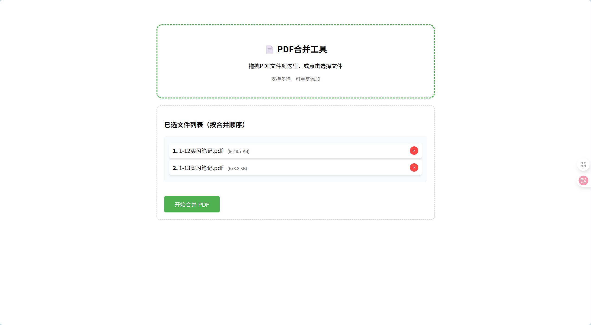

📄 PDF Merger


一款现代、优雅的PDF文件合并工具，采用Windows 11设计风格，支持拖拽操作和批量处理。



## ✨ 特性亮

### 🖱️ **智能拖拽操作**
- 支持多文件拖拽上传
- 实时视觉反馈
- 自动重复文件检测
- 拖拽排序功能

### 📄 **强大的PDF处理**
- 多PDF文件批量合并
- 保持原始文件质量
- 智能文件排序
- 支持大文件处理（最大50MB）

### 🚀 **一键式操作**
- 简单直观的用户界面
- 进度实时显示
- 自动下载合并结果
- 错误友好提示

## 🚀 快速开始

### 环境要求
- Python 3.8+
- pip（Python包管理器）

### 安装步骤


1. **创建虚拟环境（推荐）**
```bash
# Windows
python -m venv venv
venv\Scripts\activate

# Mac/Linux
python3 -m venv venv
source venv/bin/activate
```

2. **安装依赖**
```bash
pip install -r requirements.txt
```

3. **运行应用**
```bash
python app.py
```

4. **访问应用**
打开浏览器，访问：`http://localhost:5000`

## 📁 项目结构

```
pdf-merger-pro/
├── app.py                 # Flask后端主程序
├── requirements.txt       # Python依赖包
├── README.md             # 项目说明文档
├── templates/
│   └── index.html        # 前端界面
├── uploads/              # 临时文件目录（自动创建）
```

## 🎯 使用指南

### 基础使用
1. **添加文件**：拖拽PDF文件到上传区域，或点击区域选择文件
2. **调整顺序**：拖拽文件列表中的项目调整合并顺序
3. **开始合并**：点击"开始合并"按钮
4. **下载结果**：合并完成后自动下载`merged.pdf`

### 高级功能
- **批量选择**：按住Ctrl或Shift键多选文件
- **顺序调整**：拖拽文件列表项目重新排序
- **撤销操作**：支持删除已添加的文件
- **进度跟踪**：实时显示上传和合并进度


## 🔧 配置选项

在`app.py`中可以调整以下配置：

```python
# 上传文件大小限制（默认50MB）
app.config['MAX_CONTENT_LENGTH'] = 50 * 1024 * 1024

# 允许的文件扩展名
ALLOWED_EXTENSIONS = {'pdf'}

# 服务器设置
app.run(
    host='0.0.0.0',    # 允许外部访问
    port=5000,         # 端口号
    debug=True         # 调试模式
)
```


